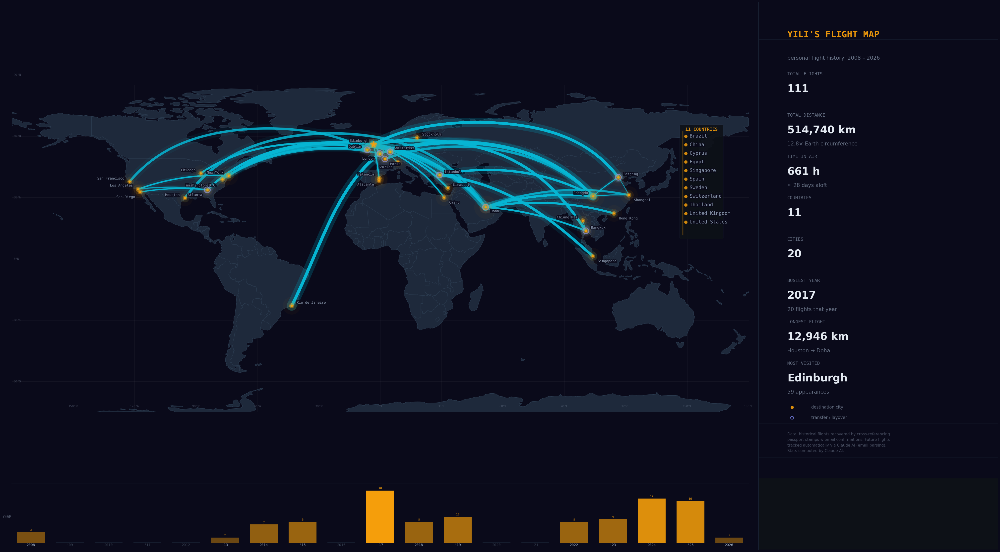

# Yili's Flight Map

A personal flight history visualizer. The world starts dark. Every city I've visited glows through the fog. Every flight draws a luminous arc across the map.

Inspired by [Fog of World](https://fogofworld.app/) and [Flighty](https://flighty.com/).



---

## How It Works

**Visualize** — flights render on a 2D flat map. Cities clear the fog in a warm amber radius. Flight paths arc as great-circle curves between them. A timeline slider replays my travel history year by year.

**Stats** — total distance, time in the air, countries, cities, busiest year, longest route, and most-visited city — computed by Claude AI.

**Monitor** — connects to Gmail to detect new flight bookings automatically. Claude AI parses confirmation emails from any airline or booking platform, extracts the route and date, and adds it to the map.

**Edit** — add, modify, or delete flights manually. Import/export as CSV.

---

## Data

All flights live in a single CSV:

```csv
year,origin_city,transfer_city,dest_city
```

`transfer=1` marks a row where the destination is a transit hub (Doha, Istanbul, Amsterdam, etc.) rather than a true visited city — used to differentiate glowing destination dots from dimmer hub dots on the map.

The repo ships with 101 flight segments (2008–2026) across 13 countries, 26 cities, and 6 transit hubs.

### How the data was compiled

Historical flights (2008–present) were recovered, deduplicated, and cleaned by cross-referencing:
- **Passport stamp images** — entry/exit dates and countries used to infer routes
- **Email confirmations** — booking emails from Trip.com, Qatar Airways, Delta, Expedia, and others parsed for flight details

Where records overlapped or conflicted, Claude AI was used to reconcile and assign confidence scores. Entries still needing manual review are flagged with `needs_review=1`.

Future flights are tracked automatically: Claude AI monitors Gmail for new booking confirmations and adds them to the dataset without manual input.

---

## Updating the Flight History

There are two ways to keep the map current:

**1. Direct CSV edit**

Open `flight_history.csv` and add or modify rows manually. Each row is one flight segment. Re-run `python3 visualize.py` to regenerate the map image.

**2. Automatic tracking via Claude AI**

Use the "Scan Email" feature in the web app. It searches Gmail for flight confirmations, sends each email body to the Claude API for structured extraction, deduplicates against existing data, and presents a review panel before appending to the dataset.

---

## Tech Stack

| | |
|---|---|
| Visualization | Python · Matplotlib · NumPy |
| Web App | React + Vite |
| 2D Map | D3.js + topojson |
| Styling | Tailwind CSS + Notion-inspired design |
| Email Parsing | Anthropic Claude API |
| Email Access | Gmail API |
| Hosting | GitHub Pages |

---

## Setup

### Python visualizer

```bash
git clone https://github.com/YOUR_USERNAME/travel-map.git
cd travel-map

python -m venv .venv
# Windows:
.venv\Scripts\activate
# macOS / Linux:
source .venv/bin/activate

pip install -r requirements.txt
python visualize.py          # regenerates flight_map.png
```

### Web app

```bash
npm install
npm run dev
```

```env
VITE_ANTHROPIC_API_KEY=your_key_here
```

---

## License

MIT
