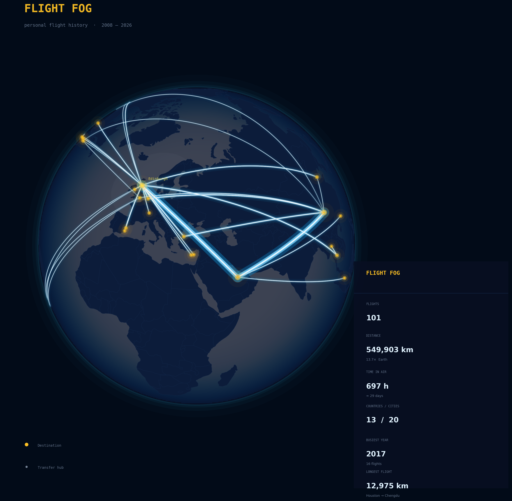

# ✈️ travel map

my personal flight history as a fog-of-world map. The world starts dark. Every city I've visited glows through the fog. Every flight draws a luminous arc across the map.

Inspired by [Fog of World](https://fogofworld.app/) and [Flighty](https://flighty.com/).



---

## How It Works

**Visualize** — flights render on a 3D globe and 2D flat map. Cities clear the fog in a warm radius. Flight paths arc between them. A timeline slider replays my travel history year by year.

**Monitor** — connect Gmail to detect new flight bookings automatically. AI (Claude API) parses confirmation emails from any airline or booking platform, extracts the route and date, and adds it to my map.

**Stats** - Generate stats such as flights, total time, distance, airports and other interesting or meaningful insights.

**Edit** — add, modify, or delete flights manually. Import/export as CSV. 

---

## Data

All flights live in a single CSV:

```csv
date,origin_city,origin_country,dest_city,dest_country,transfer
```

`transfer=1` marks a row where the destination is a transit hub (Doha, Istanbul, Amsterdam, etc.) rather than a true visited city — used to differentiate glowing destination dots from dimmer hub dots on the map.

The repo ships with 101 flight segments (2008–2026) across 13 countries, 20 destination cities, and 6 transit hubs. Routes are compiled from passport stamps, booking emails, and inference.

---

## Tech Stack

| | |
|---|---|
| Framework | React + Vite |
| 3D Globe | Three.js |
| 2D Map | D3.js + topojson |
| Styling | Tailwind CSS (dark theme) |
| Email Parsing | Anthropic Claude API |
| Email Access | Gmail API |
| Hosting | GitHub Pages |

---

## Setup

```bash
git clone https://github.com/YOUR_USERNAME/flight-fog.git
cd flight-fog
npm install
npm run dev
```

For the email watcher:

```env
VITE_ANTHROPIC_API_KEY=your_key_here
```

---

## License

MIT